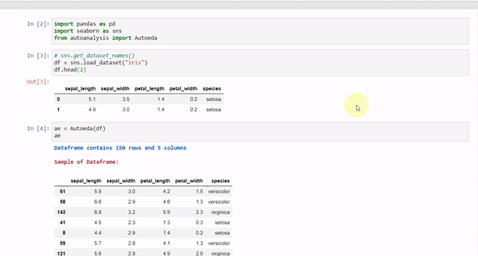

# AI-Chatbot

### Python library for building custom AI Chatbot in one line, by just specifying expected input and output patterns.


<!-- ## Features -->


Demo Output of AI Chatbot
<!-- <br><br>
 -->

## Get Started

Install the package
```
pip install aichatbot
```

Load the module
```python
from aichatbot import MLeda
```

Load the dataset and let the magic of automated EDA begin

<!-- ```python
df = pd.read_csv("./datasets/iris.csv")
ae = MLeda(df)
ae
``` -->

Python Package: https://pypi.org/project/aichatbot/


